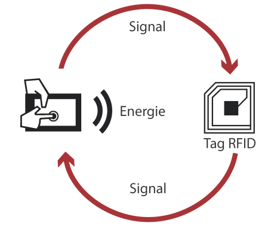

# Introduction

---

## Objectifs

Avec la croissance des produits **RFID**, il est important de bien comprendre comment la technologie *fonctionne* et comment l’*utiliser* de la manière la plus efficace.   

Nous allons voir comment fonctionne la techno, et utilisser une carte **Mifare Classic 1K** pour exemple.  
Nous allons ensuite essayer de trouver les **failles de sécurité** de cette carte, et en exploiter afin de **hacker** puis **cloner** la carte en question.  

--- 

## RFID ou Radio Frequency IDentification

Tous les jours nous utilisons des **produits RFID** sans le savoir : cartes de transports, des étiquettes antivols dans les magasins, des badges de sécurité ou plus récemment des clés sans contact pour voiture.  

Cette technologie a pour avantager de faire gagner du temps aux usagers et de permettre une lecture rapide des données.  

La RFID est une méthode qui permet de **mémoriser et récupérer des données à distance**.   
Le système est activé par un *transfert d’énergie électromagnétique* entre une étiquette radio (passive le plus souvent) et un émetteur RFID (actif).  

L’étiquette radio, composée d’une puce électronique et d’une antenne,  reçoit le signal radio émis par le lecteur RFID.  
Les composants permettent à la fois de lire et de répondre aux signaux.

{: style="height:450px;width:700px;align=center"}

---

## Exemples concrets  

### Tokyo et la Pub

A Tokyo, plus de 10 000 Marqueurs RFID ont été installés dans les rues afin d’informer les piétons lors de leurs déplacements ou encore pour envoyer certaines promotions ciblées dans la rue.  

!!! info
    Ce projet était un test. Il a été fait dans le respect des données personnelles des utilisateurs.

---

### Paris et les Arbres

Paris a inséré des puces RFID (fiches) dans 95 000 arbres pour assurer un suivi de ces derniers.   
Pour lire et/ou renseigner ces fiches, les agents municipaux sont munis d’un terminal nomade capable de lire les puces RFID.  
Par ce système, Oracle met en avant une réduction des «paperasseries et lourdeurs administratives».

!!! info
    Ces puces, insérées à 2 cm de profondeur dans les troncs, se présentent sous la forme d'un cylindre de 3 cm de long intégrant une seule information: le numéro d'identification de l’arbre.   
    En passant le lecteur portable à 15 cm de distance, l’agent peut accéder à la fiche de chaque arbre sur une base de données embarquée.
    Il peut ensuite y ajouter / modifier sa date de plantation, ses arrosages, les maladies diagnostiquées, ou encore les éventuels traumatismes occasionnés notamment par les chocs de véhicules.
    La base centrale est mise à jour chaque soir lorsque les terminaux nomades se rechargent sur leurs stations d'accueil.   

---

### Améliorations du quotidien

Pour simplifier la vie des ménages, les entreprises ont introduits la RFID dans beaucoup d’objets du quotidien tels que :

- les péages électroniques d’autoroute (Vinci)
- les transports en commun (pass Navigo)
- les passeports biométriques (L'Etat)
- le paiement sans contact... (Les banques)

---

### Lutte contre le vol et la contrefaçon

La RFID permet également de lutter contre le vol à l’étalage grâce à des étiquettes antivol discrètes à poser directement sur le produit ou sur l’emballage.

---

### La traçabilité des produits

#### Chez les animaux

L’une des utilisations les plus anciennes pour ce type de procédé vient des années 80 pour l’identification et la traçabilité du bétail. La technologie RFID permet de contrôler les animaux de leur naissance jusqu’à l’abatage sans fraude, pour une meilleure traçabilité pour le consommateur et l’agriculteur.    
Aujourd’hui, de plus en plus de puces sous cutanées sont introduit sous la peau de certains animaux notamment pour une meilleure identification des animaux de compagnie (en cas de perte) ou un contrôle des animaux en voie de disparition.  

#### Dans les chaines de production et livraison

L'étiquette est posée sur le produit ou sur son emballage au cours de sa fabrication.   
La puce permet de tracer le produit durant son parcours : pendant le transport en avion, le stockage ou encore la mise en rayon dans un magasin.  
Cette technique permet d’estimer au mieux le coût et la durée de la chaîne logistique.   
Aussi, cela permet d’anticiper des dysfonctionnements et d’obtenir un historique du produit en cas de dommages.  

---

### Gestion des stocks de magasins

On retrouve ici le picking en rayon ou la gestion des stocks dans sa globalité.

Dans les magasins et usines qui possèdent des stocks, le tag RFID est le moyen d’analyser rapidement les flux du stock jusqu’à la vente.  
La caisse communique avec l’ordinateur mettant ainsi à jour la liste du stock.  
La technologie informe de l’arrivée et de la sortie du produit.  
En cas de vol dans un stock, il est possible de retracer le parcours du produit.   
Au-delà des stocks, les magasins peuvent également accélérer l’inventaire en boutique.   

#### Tesco 
Des entreprises telles que Tesco, une marque britannique, utilisent des robots équipés de lecteurs RFID pour lire les puces et faire l’inventaire.
Les étiquettes RFID permettent de reconnaître un produit et d’obtenir toutes ses caractéristiques.   

#### Decathlon
Pour optimiser au mieux sa chaîne logistique, des entreprises comme Décathlon utilisent la technologie RFID pour reconnaître les produits et les échanger sans tickets de caisse.

---

### Dans le futur

Dans le futur, nous pourrons voir la RFID dans d’autres domaines tels que la médecine, dans les poubelles publiques, ou reliés à une connexion Wi-Fi. 

Esso a, par exemple, mis en place un système qui permettrait de s’approvisionner en carburant grâce à un lecteur positionné dans sa voiture.

Etc ...
