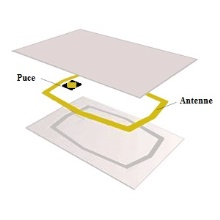
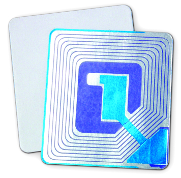
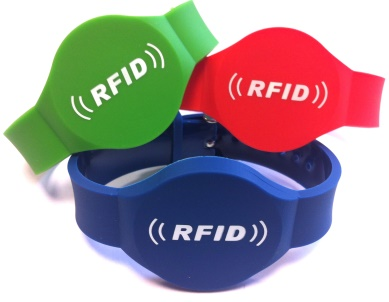
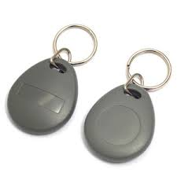
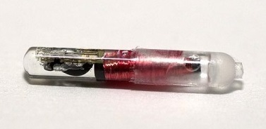

# Puces et Lecteurs RFID

---

## Types de supports par usages

!!! tip
    La liste ci-dessous n'est pas exhaustive !
    

!!! note
    Pour chacun de ces supports, la puce peut être à **usage unique** (lecture seule) ou bien **réinscriptible** (lecture et écriture avec mémoire).

| Support  {: style="width:200px;overflow:hidden" }              | Usage {: style="width:700px;overflow:hidden" }                                             |
| -------------------- | --------------------------------------------------------- | 
| {: style="height:150px;width:150px"} | Paiement sans contact Contrôle d’accès en entreprise Transports Cartes de fidélité |
| {: style="height:150px;width:150px"} | Stockage et inventaire Lutte contre la contrefaçon Traçabilité des produits |
| {: style="height:150px;width:150px"} |     Identification des personnes Paiement sans contact Promotion dans les événements |
| {: style="height:150px;width:150px"} |     Accès à des résidences locaux et parking Badge RFID d’accès en entreprise |
| {: style="height:150px;width:150px"} | Identification d’animaux |

---

## Fréquences utilisées

La fréquence est la caractéristique qui permet d’établir la communication entre la puce et le lecteur.   
Plus la **fréquence est élevée**, plus la **distance de lecture s’agrandit**.   

En fonction de ces éléments, la puce sera plus ou moins puissante et plus onéreuse.

|  Types de fréquence  | Fréquence de fonctionnement | Distance de lecture (m) | Taux de transfert |              Normes             |
|:--------------------:|:---------------------------:|:-----------------------:|:-----------------:|:-------------------------------:|
| Basse fréquence      | < 135 kHz                   | 0.5                     | 1kb/s             | ISO 142231 ISO 18000-2          |
| **Haute fréquence**      | **13,56 Mhz**                   | **1**                       | **25kb/s**            | **ISO 14443 ISO 15693 ISO 18000-3** |
| Très haute fréquence | 863 à 915 Mhz               | 3 à 6                   | 28kb/s            | ISO 18000-6                     |

!!! tip
    Dans ce cours nous allons utiliser des puces RFID HF.
    
---

## Puces Passive vs Active

Cette technologie se décline en trois versions :

- La RFID passive :  
  Fonctionne en lecture seule puisque la puce ne possède pas de batterie et doit être déplacé vers le lecteur pour être lu. Un puissant signal électromagnétique lui est alors envoyé, ce qui permet d’activer la puce RFID et de lire les informations qu’elle contient.  

- La RFID active :  
  Fonctionne avec une source d’énergie telle qu’une petite pile ou une batterie, ce qui permet de lire la carte à plus longue distance.   

- La RFID semi-passive :   
  Tout comme la RFID active, la RFID semi-passive est alimenté par une source d’énergie. Cependant, la batterie alimente la puce RFID à des intervalles de temps réguliers (économie d'énergie). Celle-ci n’envoie pas de signal.

--- 

## Lecteurs

Pour pouvoir communiquer avec les tags RFID, il faut un lecteur **fixe** ou **portable**.   
Ce lecteur a pour but de lire les données si elles ont été enregistrées à leur conception ou bien de modifier le contenu si la puce le permet.   

|   Types  |                                               Caractéristiques                                               |                                                     Distance de lecture                                                     |                                        Fréquence                                        |
|:--------:|:------------------------------------------------------------------------------------------------------------:|:---------------------------------------------------------------------------------------------------------------------------:|:---------------------------------------------------------------------------------------:|
| Fixe     | Sous forme de portique ou bornes notamment en caisse de supermarché, en contrôle d’accès, à la bibliothèque. | Proximité : 25cm (le plus commun)  Voisinage : jusqu’à 1m  Moyenne distance : jusqu’à 9m  Longue portée : centaines de mètres. | Basse fréquence LF 125 Khz  Haute fréquence HF 13,56Mhz   Très haute fréquence UHF 868Mhz |
| Portable | Flasher portatif pour lire les étiquettes manuellement. Les étiquettes n’ont pas besoin d’être déplacées.      | Quelques centimètres à quelques mètres                                                                                      | Basse fréquence LF 125 Khz  Haute fréquence HF 13,56Mhz  Très haute fréquence UHF 868 Mh  | 