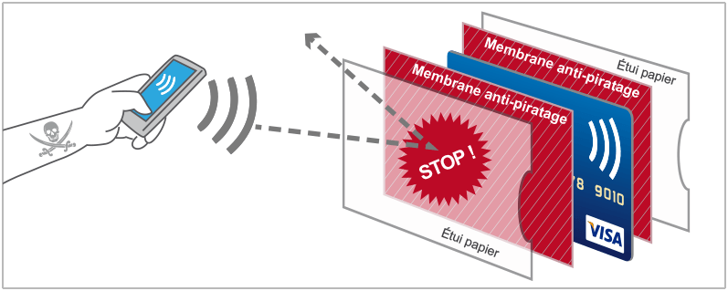

# Limites du RFID

---  

Comme toute technologie, la RFID possède ses propres limites.  
La diffusion de l’information pose problème pour toutes les questions sur la **sécurité de la vie privée**.   

!!! warning
    Une carte non sécurisée peut être facilement copiée pour récupérer ou modifier les données sensibles.

De ce fait, il est nécessaire **d’apporter plus de sécurité** :

- Protéger les cartes et badges RFID d’accès grâce à des étuis de protection empêchant la récupération des données  
- Limiter la durée de vie des données enregistrées sur les cartes RFID (La carte Navigo ne donne que les trois dernières stations pour ne pas tracer les individus et éviter la fraude)  
- Chiffrer ou coder les données pour ne pas risquer de divulguer des informations sensibles telles que des informations d’identités, des données bancaires…
- Pour permettre l’identification d’une carte, associer une photo pour reconnaître le propriétaire de la carte ou imprimer un hologramme pour authentifier la carte.

{: style="height:400px;width:900px;align=center"}

Aussi, toutes les puces ne sont pas lisibles à la même distance et dans les mêmes conditions. 
La **transmission des ondes est limitée** à travers certains murs et certains métaux.  