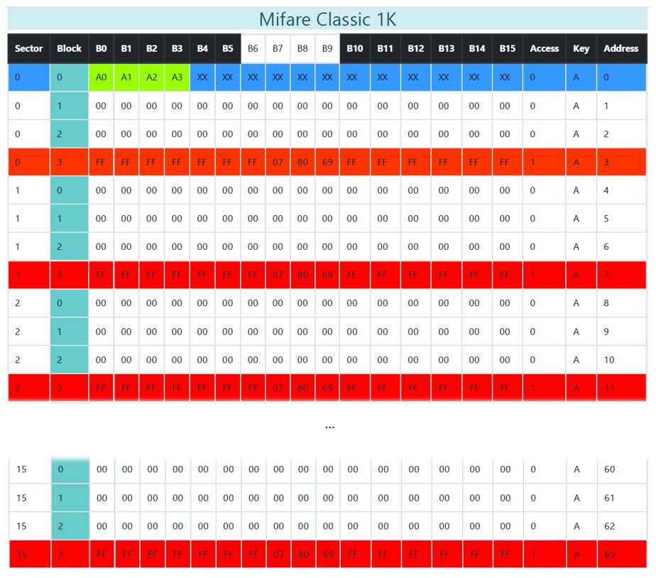
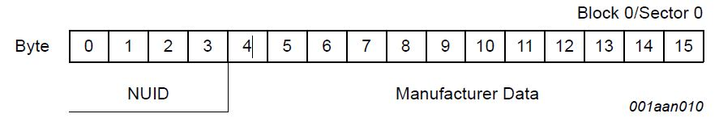
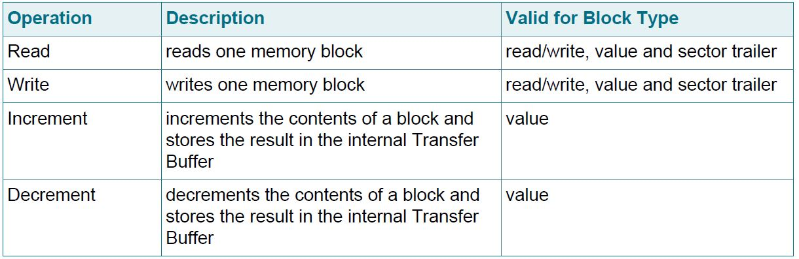
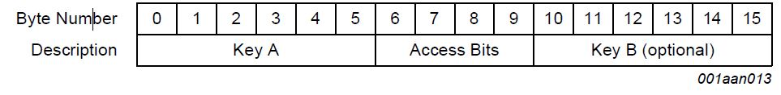
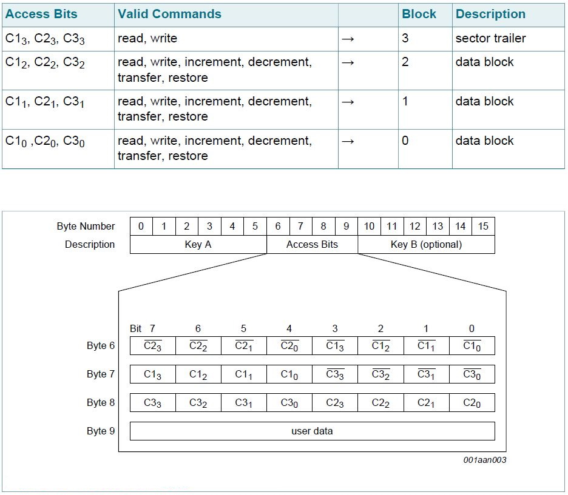

# Etude - MIFARE Classic 1K

---  

Mifare produit des cartes à puce et RFID de haute qualité.  
Nous allons observer la Mifare Classic 1K, car elle est ancienne et possède quelques failles de sécurité à exploiter.  
Malgrès cela elle reste très répandue dans le marché de la RFID low cost ...

---

## UID

Tous les badges et cartes Mifare possèdent un identifiant unique : l'UID.  
Il est codé sur **4 Bytes.** 

---

## Structure générale

Il est important de connaitre l'oirganisation de la mémoire d'une carte pour espérer pouvoir exploiter ses failles.  

Une Mifare 1K se décompose ainsi :

- **1024 Bytes au total**, d'ou son nom.
- Coupés en **16 Sectors** (0-15)
- Chaque Sector se compose de **4 Blocks**
- Chaque block contient **16 Bytes**

!!! info
    4 * 16 * 16 = 1024 !
    
Le **block 0** est appelé **"Manufacturer Block"**. Il contient des infos sur la cartes, notamment son UID.  

De plus le **4ème block de chaque secteur** est appelé **"Sector Trailer"**.    

 

---

## Manufacturer Block

Il s'agit du **premier bloc de données** (bloc 0) du **premier secteur** (secteur 0).   
Il contient les données du fabricant, mais surtout l'**UID** de la carte, identifiant UNIQUE.

!!! warning
    Ce bloc est programmé et **protégé en écriture** dans le test de production.
    

    
!!! tip
    Il existe des cartes chinoises appelées "Magic Cards", dont le bloc 0 est accessible en écriture ...  
    Cela permet de cloner des cartes ! :skull:
---

## Data Block

Block permettant de stocker des données brutes.  
Leur codage est libre.

---

## Value Block

Block permettant de stocker de manière sécurisée des données de type Integer.  
Leur codage fixé permet la detection d'erreur, leur correction et restoration.  
Ils sont utilisés notamment dans les porte-feuils électroniques.

---

## Accès Mémoire

Avant toute opération de mémoire, la carte doit être sélectionnée et authentifiée.  
Les opérations de mémoire possibles pour un bloc adressé dépendent de la clé utilisée lors de l'authentification et des access conditions stockées dans le sector trailer associé.

---

## Sector Trailer

C'est le 4ème secteur de chaque Block. Dans ce secteur on retrouve les 2 clés A et B.  
- A sur les 6 premiers octets
- B sur les 6 denriers octets
Les clés A et B régissent l'accès aux différentes parties de la mémoire, par secteur.  

Il y a donc une gestion de l'authentification sur ces cartes.

Les 4 octets du milieux sont les **Access Bits**.

!!! tip
    Par defaut, les clés A et B sont à la valeur : ``FF FF FF FF FF FF``
    
---

## Access Bits 

Ce sont les octets 6, 7, 8 et 9 du sector trailer.  
Seules les bits 6, 7 et 8 sont utilisés pour coder les conditions d'acces des block 0, 1, et 2.
L'octet 9 est libre d'accès à l'utilisateur.

!!! tip
    Par defaut, les access bits sont à la valeur ``FF 07 80``

Le codage des access bit ne sera pas décrit ici car trop complexe, mais peut être trouvé dans la Documentation de la [Mifare Classic 1K](./assets/files/Mifare+Classic+Documentation.pdf).

