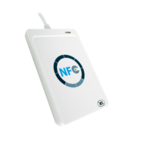
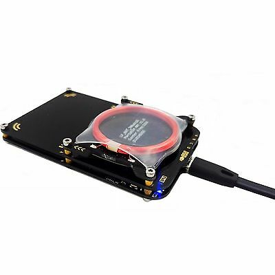
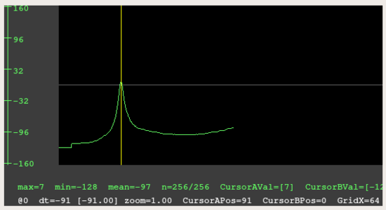

# TP - MIFARE Classic 1K Ethical Hacking

---  

## Lecture / Ecriture avec Clé connue (ACR122u)

Le ACR122u est un lecteur graveur de tag RFID, le seul respectant tous les standards actuellement en vigueur.  
Nous allons l'utiliser pour lire et écrire des blocks de données sur une carte dont **nous connaissons la Key A**.  

Ce lecteur vient avec son propre SDK et coute entre 25€ et 30€.


  
### ACR122u Tool - UID

1. Connecter le lecteur au PC
1. Ouvrir le logiciel 'ACS SMart Card Reader'
1. Selectionner `Smart Cards > MIFARE SERIES > Mifare Classic > Mifare Classic Card Tool`
1. La LED du lecteur est rouge
1. Poser la carte **#1** sur le lecteur, la LED devient verte
1. Cliquer sur ```New Connection > PC/SC Connection``` pour connecter le lecteur
1. ``Card UUID`` permet de récupérer l'UID de la carte

### ACR122u Tool - ATR

Comme sur une smart card, on voit l'ATR (Answer To Reset) passer quand on pose la carte sur le lecteur.   
Cela nous donnera l'accès aux commandes cartes.  

1. Il faut maintenant Charger les Clés dans le lecteur : 
``Load Key > Key Structure : 00 / Key Number : 00 / Key > FF FF FF FF FF FF`` (Default Transport Configuration pour toute nouvelle carte)
``Load Key > Key Structure : 00 / Key Number : 01 / Key > FF FF FF FF AA AA`` (Clé modifiée du secteur 1).

1. Puis on peut ``Authenticate`` sur le block de notre choix : **Block 00** (en HEX), avec la Clé A n° 00 provisionnée au dessus.
1. On peut enfin ``Read`` le Block 0 (en HEX) sur une longueur de **OF** et retrouver notre UID !
1. On peut lire les Blocks 1 et 2, ils ne contiennent que des 0.
1. On peut aussi lire le Block 3 qui est le sector trailer du secteur 0.

### ACR122u Tool - Read / Write Data Block in Sector 1

1. Authenticate sur Block 4
1. Write & Read le Block 4 (Peut être décodé en ASCII)
1. Authenticate sur Block 5
1. Write & Read le Block 5 (Peut être décodé en ASCII)

!!! warning
    Pour lire, il faut spécifie ru longueur > 0
    Pour écrire, il faut écrire TOUT le bloc (Longueur 16 Octets donc 0x10)

!!! tip
    Le numéro du block doit être mis en Hexa. Si on veut le block 11, il faut mettre ``0x0B``.

### ACR122u Tool - Read / Write Sector Trailer

1. Authenticate sur Block 3
1. Essayer de Read le block 3.

!!! tip
    On remarque que la clé A ne peut pas être lue, on récupere ``00 00 00 00 00 00``  
    Et on ne pourra jamais la lire sur une Mifare, il faut obligatoirement que le lecteur la connaisse au préalable !
    
!!! tip
    Pour modifier les clés facilement, il faut utiliser **"Easy Key"**.
    
1. Utiliser `Easy Key` pour changer la clé A
1. S'authentifier avec la Clé A : ``FF FF FF FF FF FF`` sur le **Sector 1**
1. Updater la Clé A du Sector 1 en  : ``FF FF FF FF AA AA``, puis cliquer sur ``Format Sector``

!!! tip
    Le bloc numéro **3** du sector est updaté automatiquement car c'est le Sector Trailer !
    
1. S'authentifier en utilisant la nouvelle clé sur le secteur 1
1. Modifier la clé B en ; ``FF FF FF FF BB BB``

!!! tip
    On pourrait aussi modifier les Access Bits ...

1. Verifier ces changements en essayant de lire les blocks 5 ou 6 avec les anciennes clés. Cela devrait échouer. Block 8 devrait fonctionner car il appartient au secteur 2 que nous n'avons pas modifié.
1. Charger les nouvelles clés et s'authentifier avec. 
1. Verifier que l'on peut maintenant lire les Blocks 4 & 5.

---

## Hack de Clés (Proxmark3)

Le Proxmark 3 est un outil qui permet des tests de penetration, du clonage et de la simulation de tag RFID.  
Il coûte environ 40€ en Chine mais plus de 150€ en Europe ...   

Il vient avec le logiciel ``proxmark3`` qui lui est open source.




### Trouver la fréquence d'un badge inconnu

Il existe trois commandes principales :

- ``hw`` : pour l’envoi de commandes hardware au Proxmark 3 ;
- ``lf`` et ``hf`` : pour manipuler la basse et la haute fréquence.

Tentons de détecter la fréquence de fonctionnement d’un tag inconnu.   
Il existe une fonction dans le Proxmark 3 qui mesure la chute de tension induite dans l’antenne lorsqu’un tag s’alimente.  

La commande ``hw tune`` renseigne les tensions présentes dans les deux antennes (basse et haute fréquences). ` 
Si nous lançons le client avec le support Qt5, la commande tracera également une courbe de tension de l’antenne basse fréquence en fonction de la fréquence utilisée, montrant ainsi à quelle fréquence l’antenne LF fonctionne de manière optimale.

Si on mesure les tensions présentes avant et après l’approche du tag sur les antennes haute et basse fréquences, on observera une chute importante de la tension à la fréquence de fonctionnement du tag.

```bash linenums="1"
proxmark3> hw tune l

Measuring antenna characteristics, please wait........
# LF antenna: 45.51 V @ 125.00 kHz
# LF antenna: 23.10 V @ 134.00 kHz
# LF optimal: 45.51 V @ 125.00 kHz
Displaying LF tuning graph. Divisor 89 is 134khz, 95 is 125khz.
```

Dans cet exemple, le hw tune est lancé sans carte, la **tension induite** est de **45,51 V**.

```bash linenums="1"
proxmark3> hw tune l

Measuring antenna characteristics, please wait........
# LF antenna: 26.81 V @ 125.00 kHz
# LF antenna: 30.80 V @ 134.00 kHz
# LF optimal: 34.65 V @ 130.43 kHz
Displaying LF tuning graph. Divisor 89 is 134khz, 95 is 125khz.
```

Même opération avec une carte à proximité de l’antenne : on voit que la **tension a chuté à 26,81 V** lorsque l’antenne basse fréquence fonctionnait à 125 kHz.   
Dans le cas présent, nous constatons donc que le tag inconnu fonctionne à **125 kHz**.




### Default Keys Attack

Cette attaque est simple, elle consiste à vérifier toutes les clés par défaut des différents constructeurs les une à la suite des autres afin de trouver des secteurs qui les utilisent.
Ce sera notre point d'entrée pour la suite.

Nous utilisons la carte avec les clés modifiées sur le secteur 1.

```bash linenums="1"

proxmark3> hf 14a read

proxmark3> hf mf chk *1 ? t

```

Tous les secteurs utilsient les clés par defaut sauf notre secteur 1 qui résiste encore.

### Nested Attack

L'étape précdent nous offre la possibilité de s'authentifier sur un ou plusieurs secteurs de la carte avec les clés par défaut.  
Cela nous ouvre les portes de la **Nested** Attack (De l'interieur).  

!!! info
    Le mifare classic 1k a un générateur de nombres aléatoires faible (RNG) qui est essentiellement un registre à décalage avec un petit plus.   
    Sa faiblesse vient de la possibilité de restaurer le *nonce*[^1] généré de 32 bits.   
    Si nous nous authentifions plusieurs fois avec une clé connue, nous pouvons trouver le nombre médian de décalages et deviner assez précisément le nonce non crypté en annulant le nonce crypté (nous nous sommes déjà authentifiés et nous connaissons le cryptage).   
    Puisque ce nonce est initialisé par la clé symétrique XOR avec l'UID de la carte, nous pouvons effectivement trouver 32 bits de la clé de 48 bits.
    
[^1]: En cryptographie, un nonce est un nombre arbitraire destiné à être utilisé une seule fois, souvent aléatoire.


```bash linenums="1"
proxmark3> hf mf nested 1 * t
```    

La/les clés manquantes sont trouvées ! On peut lire le secteur :

```bash linenums="1"
proxmark3> hf mf rdsc 1 A ffffffffaaaa
```    

!!! Danger
    Pour se protéger de ses 2 attaques il faut donc systématiquement modifier **TOUTES** les clés de **TOUS** les secteurs !!
    
    
### Darkside Attack

Les manipulations ci-dessus n’ont été possibles que parce que nous avons découvert une clé par défaut omise par les administrateurs des équipements.  
L’attaque dite Darkside ou de Courtois, du nom de son découvreur Nicolas Courtois, va tenter de retrouver une clé configurée dans un tag en exploitant un défaut dans l’initialisation du générateur de nombres aléatoires du microcontrôleur du tag (le générateur commence toujours par la même valeur lorsque la carte est alimentée, donc si on contrôle finement le timing, on prédit le nombre aléatoire tiré par le tag). Dès qu’une première clé est découverte, il sera alors possible de passer à l’attaque Nested.  

```bash linenums="1"
proxmark3> hf hf mf mifare
```    

Ici aussi, si le tag MIFARE est trop récent, l’attaque échouera et on devra recourir à d’autres types d’attaques.

### Man-in-the-Middle Attack   

Si la carte a résisté aux attaques précedentes, il faut sniffer la communication entre le lecteur et le carte.  
Une fois l'achnage de clés identifier, il faut utiliser l'outils ``CRAPTO1``, qui permet de cracker le code ``CRYPTO1`` utilisé par MiFare et décoder la clé utilisée ...

Des détails peuvent êtres trouvés [ici](https://connect.ed-diamond.com/MISC/MISCHS-016/Proxmark-3-le-couteau-suisse-RFID).

### HardNested Attack 

Les tags MIFARE Classic récents ainsi que les MIFARE Plus SL1 sont plus robustes, car le générateur de nombres aléatoires et d’autres défauts ont été corrigés.   
Mais ce ne sont pas les attaques contre la MIFARE qui manquent et une nouvelle attaque du type Card-Only existe, appelée HardNested (pour Nested sur les cartes Hardened, durcies).   
Depuis la version 3.0.1 de Proxmark 3, l’attaque HardNested est disponible dans le dépôt principal.

Cette attaque va retrouver une clé dans les mêmes conditions que l’attaque Nested, mais sur un tag récent, MIFARE Classic New Generation ou MIFARE Plus SL1.
On lancera l’attaque avec la commande ``hf mf hardnested 4 B xxxxxxxxxxxxx 0 B``

Les arguments ``4``, ``B`` et ``xxxxxxxxxxxxx`` correspondent à une clé connue de notre badge, ``0`` et ``B`` la zone protégée par la clé B que l’on souhaite retrouver.

Cette attaque met `seulement 10 minutes maximum pour aboutir à un résultat.

Des détails peuvent êtres trouvés [ici](https://connect.ed-diamond.com/MISC/MISCHS-016/Proxmark-3-le-couteau-suisse-RFID).


### BruteForce Attack

Dans tous les cas, on peut aussi toutes les combinaison possible de clé jusqu'à en trouver une .... puis appliquer une Nested Attack.  
Résultat en 2 jours garantis ...


---

## Conclusion
 
Nous avons vu plusieurs cas d’attaques possibles sur des tags RFID très largement répandus dans le monde.   
De nombreux tags d’ancienne technologie sont toujours disponibles à la vente et encore largement en circulation, ce qui représente un danger pour l'utilisateur non avertis !
 
Heureusement, il existe d’autres protocoles MIFARE, plus sécurisés dans leurs échanges comme ceux des MIFARE Plus SL2 et SL3 qui implémentent la méthode de chiffrement AES 128-bit et MIFARE DESFire qui implémente du 3DES et de l’AES.